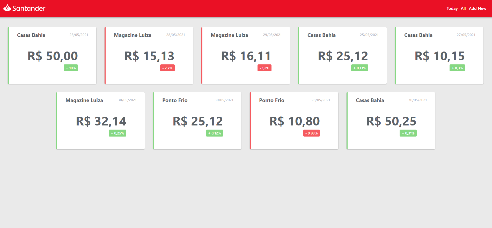
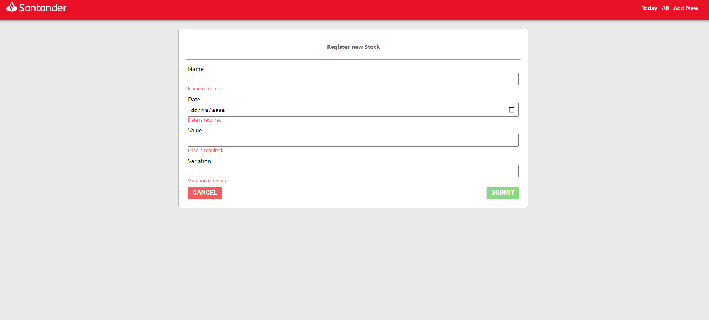
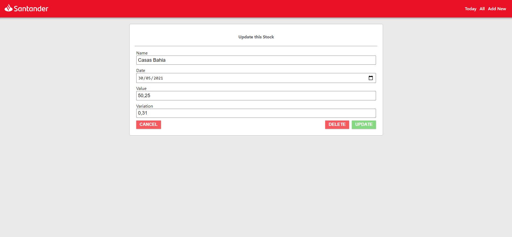

# Criando uma API de Tela de Cotações / Backend

Este projeto foi desenvolvido durante a Santander Dev Week. 

Trata-se de uma API construída com as tecnologias Java openSDK 11 (LTS) / JPA / Hibernate / JDBC / Docker / Postgres.

### Veja aqui como ficou o projeto no heroku!
https://tela-cotacoes-santander.herokuapp.com/bootcamp/swagger-ui.html

### Integração com o Frontend:
https://icarogga.github.io/Stocks/

======================================================

